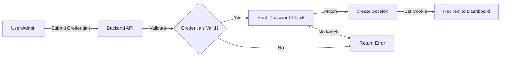

<div align="center">

# 🎯 EventHub - Event Management System

### *A modern full-stack platform for seamless event discovery, registration, and management*

[](https://developer.mozilla.org/en-US/docs/Web/HTML)
[](https://developer.mozilla.org/en-US/docs/Web/CSS)
[](https://developer.mozilla.org/en-US/docs/Web/JavaScript)
[](https://nodejs.org/)
[](https://expressjs.com/)
[](https://www.mongodb.com/)

[](LICENSE)
[](https://github.com/ashakumbhar08/event-management/stargazers)
[](https://github.com/ashakumbhar08/event-management)

[View Demo](#-screenshots) • [Report Bug](https://github.com/ashakumbhar08/event-management/issues) • [Request Feature](https://github.com/ashakumbhar08/event-management/issues)

</div>

---

## 📸 Preview

<div align="center">

### Main Dashboard

*User dashboard with personalized statistics and upcoming events*

### Admin Panel

*Comprehensive admin dashboard with real-time analytics*

### Events Gallery

*Browse and discover events with advanced filtering*

</div>

---

## 📖 About The Project

**EventHub** is a comprehensive event management system that bridges the gap between event organizers and participants. Built with modern web technologies, it provides a centralized platform for event discovery, registration, and management with role-based access control.

### 🎯 Problem Statement
Traditional event management involves manual processes, scattered information, and lack of centralized platforms. EventHub solves this by providing a unified digital solution for both event organizers and participants.

### ✨ Why EventHub?
- 🔐 **Secure Authentication** - bcrypt password hashing with session management
- 👥 **Role-Based Access** - Separate interfaces for users and administrators
- 📊 **Real-Time Analytics** - Interactive charts and statistics dashboard
- 🎫 **Digital Certificates** - Automated certificate issuance and verification
- 📱 **Responsive Design** - Seamless experience across all devices
- 🚀 **RESTful API** - Clean, documented API architecture

---

## 🌟 Key Features

<table>
<tr>
<td width="50%">

### 👤 User Features
- ✅ **Account Management**
  - Secure signup and login
  - Remember Me functionality
  - Session-based authentication
  
- 🔍 **Event Discovery**
  - Browse all events
  - Filter by category
  - Detailed event information
  - Search functionality

- 📝 **Event Registration**
  - One-click registration
  - View registered events
  - Track upcoming events
  - Duplicate prevention

- 🎓 **Certificates**
  - View earned certificates
  - Download/print certificates
  - Certificate verification

</td>
<td width="50%">

### 👨‍💼 Admin Features
- 🔑 **Admin Authentication**
  - Secure admin login
  - Separate session management
  - Demo account available

- 📅 **Event Management**
  - Create new events
  - Edit existing events
  - Delete events
  - Update event status

- 📊 **Analytics Dashboard**
  - Total events & registrations
  - Category distribution (Pie chart)
  - Status breakdown (Doughnut chart)
  - Monthly trends (Bar chart)

- 👥 **User Management**
  - View all users
  - Track registrations
  - Search & filter

- 🎫 **Certificate Management**
  - Issue certificates
  - Bulk issuance
  - Track certificates

</td>
</tr>
</table>

---

## 🛠️ Tech Stack

<div align="center">

### Frontend


### Backend


### Database


### Authentication & Security


### Tools


</div>

---

## 📁 Project Structure

```
event-management/
│
├── 📂 backend/                    # Backend server and API
│   ├── server.js                 # Express server entry point
│   ├── package.json              # Backend dependencies
│   ├── .env                      # Environment variables (ignored)
│   ├── .env.example              # Environment template
│   │
│   ├── 📂 config/
│   │   └── db.js                 # MongoDB connection
│   │
│   ├── 📂 models/                # Mongoose schemas
│   │   ├── User.js
│   │   ├── Admin.js
│   │   ├── Event.js
│   │   ├── Registration.js
│   │   └── Certificate.js
│   │
│   ├── 📂 routes/                # API endpoints
│   │   ├── userRoutes.js
│   │   ├── adminRoutes.js
│   │   ├── eventRoutes.js
│   │   ├── registrationRoutes.js
│   │   └── certificateRoutes.js
│   │
│   ├── 📂 controllers/           # Business logic
│   │   ├── userController.js
│   │   ├── adminController.js
│   │   ├── eventController.js
│   │   ├── registrationController.js
│   │   └── certificateController.js
│   │
│   └── 📂 middleware/
│       └── authMiddleware.js     # Authentication guards
│
├── 📂 frontend/                   # Frontend application
│   ├── index.html                # Landing page
│   ├── signup.html               # User/Admin signup
│   ├── login.html                # User login
│   ├── admin-login.html          # Admin login
│   │
│   ├── 📂 user/                  # User dashboard pages
│   │   ├── dashboard.html
│   │   ├── browse-events.html
│   │   ├── event-detail.html
│   │   ├── my-events.html
│   │   ├── upcoming-events.html
│   │   └── certificates.html
│   │
│   ├── 📂 css/                   # Stylesheets
│   │   ├── style.css
│   │   ├── admin-style.css
│   │   ├── admin-sidebar.css
│   │   └── admin-charts.css
│   │
│   └── 📂 js/                    # JavaScript modules
│       ├── config.js             # API configuration
│       ├── utils.js              # Utility functions
│       ├── auth.js               # Authentication logic
│       ├── events.js             # Event management
│       └── [15+ JS files]
│
├── 📂 screenshots/                # Project screenshots
├── .gitignore                    # Git ignore rules
├── LICENSE                       # MIT License
├── CONTRIBUTING.md               # Contribution guidelines
└── README.md                     # Project documentation
```

---

## 🚀 Quick Start

### Prerequisites
- **Node.js** (v14 or higher)
- **MongoDB** (v4 or higher)
- **npm** or **yarn**

### Installation

1️⃣ **Clone the repository**
```bash
git clone https://github.com/ashakumbhar08/event-management.git
cd event-management
```

2️⃣ **Install dependencies**
```bash
cd backend
npm install
```

3️⃣ **Configure environment**
```bash
# Create .env file in backend directory
cp .env.example .env

# Edit .env with your configuration
PORT=5001
MONGO_URI=mongodb://localhost:27017/eventhub
SESSION_SECRET=your_secret_key_here
```

4️⃣ **Start MongoDB**
```bash
# macOS
brew services start mongodb-community

# Linux
sudo systemctl start mongod

# Windows - Start MongoDB service from Services
```

5️⃣ **Run the application**
```bash
# Development mode (with auto-restart)
npm run dev

# Production mode
npm start
```

6️⃣ **Open in browser**
```
http://localhost:5001
```

### 🎭 Demo Credentials

**Admin Access:**
```
Email: admin@eventhub.com
Password: admin123
```

**User Access:**
Create a new account via the signup page

---

## 📡 API Documentation

### Base URL
```
http://localhost:5001/api
```

### Endpoints Overview

<details>
<summary><b>👤 User Authentication</b></summary>

```http
POST   /api/users/signup      # Create new user account
POST   /api/users/login       # Authenticate user
POST   /api/users/logout      # End user session
GET    /api/users/me          # Get current user info (protected)
```
</details>

<details>
<summary><b>👨‍💼 Admin Authentication</b></summary>

```http
POST   /api/admins/signup     # Create admin account
POST   /api/admins/login      # Authenticate admin
POST   /api/admins/logout     # End admin session
GET    /api/admins/me         # Get current admin info (protected)
```
</details>

<details>
<summary><b>📅 Event Management</b></summary>

```http
GET    /api/events            # Get all events (public)
GET    /api/events/:id        # Get single event (public)
POST   /api/events            # Create event (admin only)
PUT    /api/events/:id        # Update event (admin only)
DELETE /api/events/:id        # Delete event (admin only)
GET    /api/events/stats      # Get event statistics (admin only)
```
</details>

<details>
<summary><b>📝 Registration Management</b></summary>

```http
POST   /api/registrations                    # Register for event (user only)
GET    /api/registrations/my                 # Get user's registrations (user only)
DELETE /api/registrations/:eventId           # Cancel registration (user only)
GET    /api/registrations/event/:eventId     # Get event registrations (admin only)
GET    /api/registrations/stats              # Get registration statistics (admin only)
```
</details>

<details>
<summary><b>🎓 Certificate Management</b></summary>

```http
GET    /api/certificates/my                  # Get user's certificates (user only)
POST   /api/certificates                     # Issue certificate (admin only)
POST   /api/certificates/event/:eventId      # Issue certificates for event (admin only)
GET    /api/certificates                     # Get all certificates (admin only)
DELETE /api/certificates/:id                 # Delete certificate (admin only)
```
</details>

**Total API Endpoints:** 24

---

## 🗄️ Database Schema

### Collections

**users** • **admins** • **events** • **registrations** • **certificates**

<details>
<summary><b>View Schema Details</b></summary>

#### 👤 users
```javascript
{
  _id: ObjectId,
  name: String (required),
  email: String (required, unique, lowercase),
  password: String (required, hashed with bcrypt),
  createdAt: Date (default: now)
}
```

#### 👨‍💼 admins
```javascript
{
  _id: ObjectId,
  name: String (required),
  email: String (required, unique, lowercase),
  password: String (required, hashed with bcrypt),
  isDemo: Boolean (default: false),
  createdAt: Date (default: now)
}
```

#### 📅 events
```javascript
{
  _id: ObjectId,
  title: String (required),
  category: String (enum: Tech, Cultural, Sports, Workshop, Other),
  date: Date (required),
  time: String (required),
  location: String (required),
  description: String (required),
  maxParticipants: Number (default: 100),
  status: String (enum: Upcoming, Active, Completed),
  createdBy: String (default: "Admin"),
  createdAt: Date (default: now)
}
```

#### 📝 registrations
```javascript
{
  _id: ObjectId,
  userId: ObjectId (ref: User, required),
  eventId: ObjectId (ref: Event, required),
  userName: String (required),
  userEmail: String (required),
  eventTitle: String (required),
  registeredAt: Date (default: now)
  // Unique compound index: userId + eventId
}
```

#### 🎓 certificates
```javascript
{
  _id: ObjectId,
  userId: ObjectId (ref: User, required),
  eventId: ObjectId (ref: Event, required),
  userName: String (required),
  eventTitle: String (required),
  completedDate: Date (required),
  issuedAt: Date (default: now)
  // Unique compound index: userId + eventId
}
```

</details>

---

## 🔐 Authentication Flow



**Security Features:**
- 🔒 bcrypt password hashing (10 salt rounds)
- 🍪 HTTP-only session cookies
- ⏱️ 24-hour session expiry
- 🛡️ CORS protection
- 🚫 Duplicate registration prevention

---

## 📸 Screenshots

<div align="center">

### 🏠 Landing Page


### 👤 User Dashboard


### 📅 Browse Events


### 👨‍💼 Admin Dashboard


### 📊 Analytics


### ⚙️ Event Management


> **Note:** Add actual screenshots to the `screenshots/` directory

</div>

---

## 🚀 Future Enhancements

- [ ] 📧 Email notifications for registrations
- [ ] 🔑 Forgot password functionality
- [ ] 👤 User profile editing
- [ ] 🖼️ Event image upload
- [ ] 📱 QR code for event check-in
- [ ] 📄 Export certificates as PDF
- [ ] 💳 Payment gateway integration
- [ ] 📅 Event calendar view
- [ ] 🌐 Social media sharing
- [ ] ⭐ Event reviews and ratings
- [ ] 🔍 Advanced search filters
- [ ] 🔔 Push notifications
- [ ] 📱 Mobile application
- [ ] 💬 Real-time chat support
- [ ] 🤖 AI-based event recommendations

---

## 🤝 Contributing

Contributions are what make the open-source community such an amazing place to learn, inspire, and create. Any contributions you make are **greatly appreciated**.

1. Fork the Project
2. Create your Feature Branch (`git checkout -b feature/AmazingFeature`)
3. Commit your Changes (`git commit -m 'Add some AmazingFeature'`)
4. Push to the Branch (`git push origin feature/AmazingFeature`)
5. Open a Pull Request

See [CONTRIBUTING.md](CONTRIBUTING.md) for detailed guidelines.

---

## 📄 License

Distributed under the MIT License. See [LICENSE](LICENSE) for more information.

---

## 📊 Project Stats

<div align="center">

| Metric | Value |
|--------|-------|
| **Total Files** | 70+ |
| **Lines of Code** | 5,000+ |
| **API Endpoints** | 24 |
| **Database Collections** | 5 |
| **Frontend Pages** | 18 |
| **JavaScript Modules** | 15+ |

</div>

---

## 🐛 Issues & Support

Found a bug or have a feature request? Please open an issue:

[](https://github.com/ashakumbhar08/event-management/issues)

---

<div align="center">

## 👨‍💻 Developed By

**Asha Kumbhar**

[](https://github.com/ashakumbhar08)
[](https://github.com/ashakumbhar08/event-management)

---

### ⭐ Star this repository if you found it helpful!

### 🔗 [View Live Demo](#) • [Report Bug](https://github.com/ashakumbhar08/event-management/issues) • [Request Feature](https://github.com/ashakumbhar08/event-management/issues)

---

**Made with ❤️ for learning and education**

*EventHub © 2024 - All Rights Reserved*

</div>
